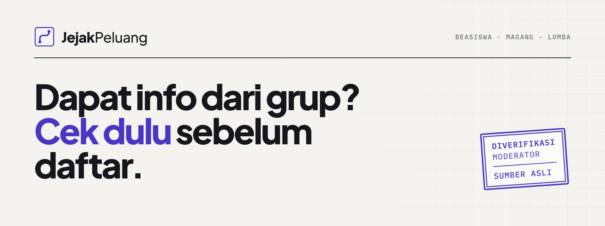
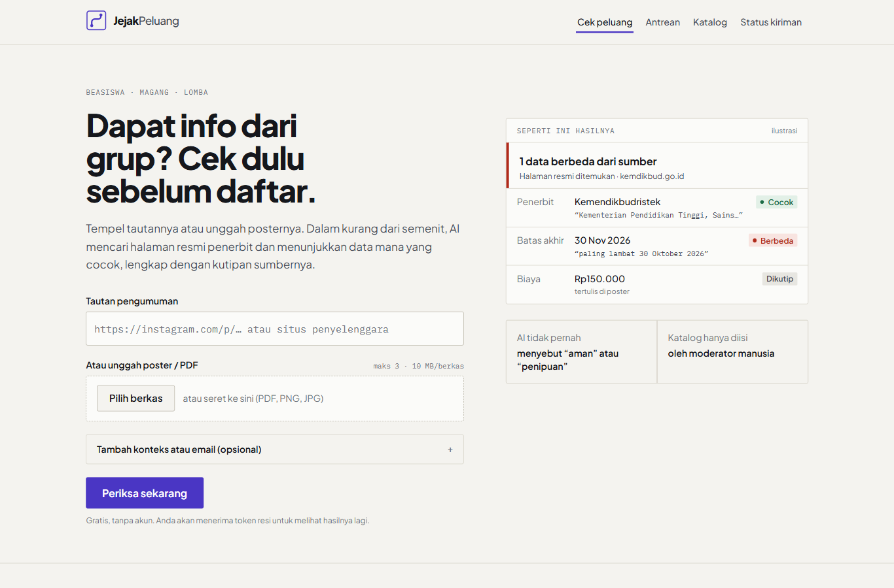
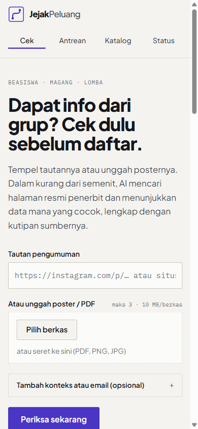
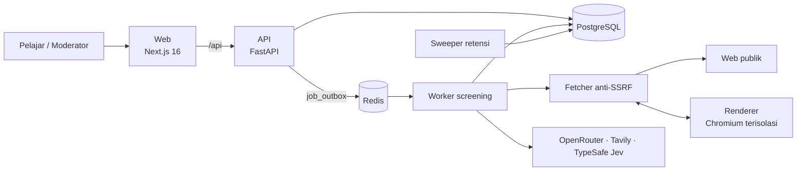

<p align="center">
  
</p>

<p align="center">
  <a href="https://jejakpeluang.joven.dev"><b>Demo langsung</b></a>
</p>

<p align="center">
  
  
  
  
</p>

**JejakPeluang** adalah pemeriksa sumber berbasis AI dan katalog peluang beasiswa, magang, serta lomba untuk pelajar Indonesia. Tempel tautan atau unggah poster, lalu dalam kurang dari semenit JejakPeluang mencari halaman resmi penerbit dan menunjukkan data mana yang cocok dan mana yang berbeda, lengkap dengan kutipan dari sumbernya.

> AI tidak pernah menyebut sebuah info "aman" atau "penipuan". AI hanya mengumpulkan bukti. Hanya moderator manusia yang bisa memasukkan peluang ke katalog.

| Desktop | Ponsel |
|---|---|
|  |  |

## Cara kerja

| | Tahap | Yang terjadi |
|---|---|---|
| `01` | **Baca** | Teks diambil dari tautan, PDF, atau poster (OCR dan kode QR), lalu diekstrak: judul, penerbit, tenggat, biaya, data yang diminta. |
| `02` | **Cari sumber** | Tavily mencari halaman penerbit. Domain penerbit yang sudah terverifikasi dicari lebih dulu. |
| `03` | **Ambil dengan aman** | Halaman diambil lewat fetcher anti-SSRF. Halaman berbasis JavaScript dirender di Chromium terisolasi. |
| `04` | **Bandingkan** | Setiap data diberi status *cocok*, *berbeda*, *tidak ditemukan*, atau *tidak terbaca*, disertai kutipan persis. |
| `05` | **Nilai** | TypeSafe Jev menilai apakah halaman itu pengumuman resmi dan apakah tenggatnya terkonfirmasi. |
| `06` | **Moderator** | Manusia memeriksa paket bukti. Hanya yang lolos masuk katalog dengan cap verifikasi. |

Status kepercayaan selalu tampil sebagai cap dengan teks yang jelas:

| Cap | Arti |
|---|---|
| **Diverifikasi moderator** | Moderator sudah mencocokkan entri dengan sumber publik penerbit. |
| **Dikonfirmasi penerbit** | Pengumuman privat yang dikonfirmasi moderator langsung ke penerbit. |
| **Dicek AI, belum ditinjau** | Baru AI yang memeriksa. Tampil di antrean, bukan di katalog. |

## Arsitektur



| Lapisan | Teknologi |
|---|---|
| Frontend | Next.js 16, React 19, TypeScript, Tailwind CSS 4 |
| Backend | Python 3.13, FastAPI, SQLAlchemy 2, Alembic, fastapi-users |
| Data | PostgreSQL, Redis (antrean tugas dan rate limit) |
| AI dan konten | OpenRouter, Tavily, TypeSafe Jev, pypdf, Tesseract OCR, Playwright Chromium |
| Kontrak | OpenAPI, tipe TypeScript dihasilkan otomatis (`packages/contracts`) |
| Infrastruktur | Docker Compose, pnpm workspace, uv |

## Menjalankan secara lokal

Butuh Node.js 24, pnpm 10 (`corepack enable`), uv (Python 3.13), dan Docker Compose v2.

```sh
pnpm install
cd services/backend && uv sync && cd ../..

cp infra/.env.example infra/.env   # isi digest image dan kunci provider
docker compose -f infra/compose.dev.yml up --build --wait
docker compose -f infra/compose.dev.yml exec api uv run alembic upgrade head
```

Web berjalan di http://127.0.0.1:3000 dan API di http://127.0.0.1:8000. Buat akun moderator (hanya lewat undangan):

```sh
cd services/backend && uv run python scripts/create_moderator.py <email>
```

Cara menjalankan tanpa Docker, daftar variabel lingkungan, detail pipeline screening, dan retensi data ada di [docs/operations.md](docs/operations.md).

## Pengujian

```sh
cd services/backend && uv run pytest          # backend
pnpm --filter @jejakpeluang/web test          # unit test web
pnpm --filter @jejakpeluang/web typecheck     # tsc --noEmit
pnpm --filter @jejakpeluang/web lint
```

## Struktur repository

```
apps/web             Aplikasi web Next.js (halaman publik + konsol moderator)
services/backend     API FastAPI, worker screening, renderer, sweeper, migrasi
packages/contracts   Kontrak OpenAPI dan tipe TypeScript
infra                Docker Compose dan contoh .env
tests/e2e            Pengujian end-to-end Playwright
```

## Tim

Dibuat oleh **Task Force H-2** dari Universitas Internasional Batam untuk lomba Web Development **SWITCHFEST 2026**, dengan tema *NextGen Secure: Building the Future of Trusted Web Ecosystems*.

| Nama | Peran |
|---|---|
| Joven | Ketua |
| Shelina | Anggota |
| Styven | Anggota |
